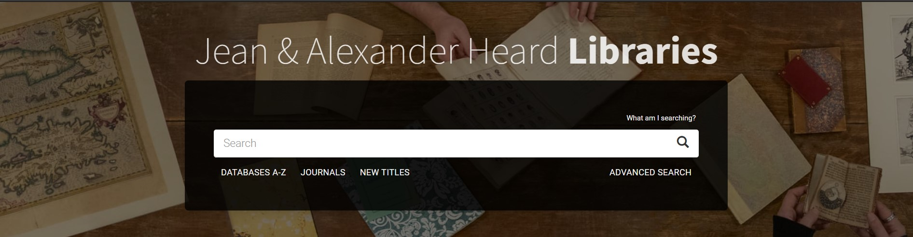

Created the repo of this website, applying what I learned from the Github Page workshop to real implementaiton

 

Many thanks to Dr. Steve Baskauf. It would be impossible for me to build this website without instructions and help from him and his Github courses. The link to his <a href="https://heardlibrary.github.io/digital-scholarship/manage/control/github/" target="_blank">DISC Github Program website</a> is provided here. The

The Digital Scholarship and Communications(DiSC) program at the Jean and Alexander Heard Libraries is a great program for beginners towards some popular techniques. Check its <a href="https://www.library.vanderbilt.edu/disc/workshops/" target="_blank">workshop website</a> if you feel interested.

